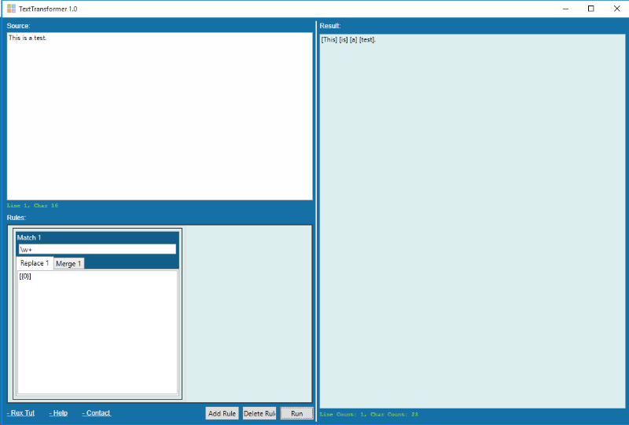

TextTransformer Overview
==========

TextTransformer is a simple text processing tool written in C#. See the screenshot below:

The GUI contains three parts:

- Source text input: the text to be processed is pasted here
- Rules: specify how the source text is to be processed, details are explained in the next section.
- Result text output: the processing result will be shown here

The solution contains three sub-projects:

1. TextTransformer - the WPF user interface. It delegates the work to my text processing engine.
2. ZCL.RTScript - implementation of the text processing engine. More details See [here](ZCL.RTScript/README_RTSCRIPT.md).
3. ZCL.Calculator - an extensible calculator used by ZCL.RTScript to evaluate captured arithmatic expression, see [here](ZCL.Calculator/README_CALCULATOR.md).

How to use
==========
The processing is defined by a list of rules. The input text is the input to the first rule, the any other rule use the output of the previous rule as its input.
Each rule works in three steps:

1. matching - an regular expression used to parse the input text into a list of matches, and each match can in turn has a list of items. 
Currently support these two match types:
	- Regex group: Each regex group will become an item. 
	That is each regex match of the regular expression will become a match, and each match group in the regex will be an item. 
	E.g. regex <code>(\d{3,3})-(\w+)</code> will have two items in each match, the first is the captured text of <code>\d{3,3}</code> and the second is the captured text of <code>\w+</code>. 
	- Regex capture: Each regex capture will become an item.
	That is each group in the regex will be come a match, and each capture in the group will be an item.
	E.g. regex <code>(\w+)+\s+(\d+)+</code> will have two matches per regex match, and the first match will contain captures of <code>\w+</code> as the items and the second match will have the captures of <code>\d+</code> as the items.

2. replacing - Each match will be transformed by a script you put in the "Replace 1" text area. See [here](ZCL.RTScript/README_RTSCRIPT.md) on how to write the script. 
For simple tasks you know need to know the awkward scripting language I invented inside out - just use <code>{0}</code> to refer to the whole match and <code>{1}</code> to refer to the first item in the match.  

3. merging - All the transformation result of the matches and the unmatched text will be merged back together using the script you put in the "Merge 1" text area. See [here](ZCL.RTScript/README_RTSCRIPT.md) on how to write the script.
Do this purly via scripting is not easy so a convenient function <code>merge</code> is provided to accommodate for the common use cases. 

Examples
==========
To be provided.

Future Plans
==========
See [the todo list](TODO.md). Also you can send me an email if you see a good enhancement for this simple tool.

